# AI 监管/人工接管 API Contract (v2.7)

> **版本**: v2.7
> **更新时间**: 2025-11-26
> **变更**: 快捷回复系统完全实现（后端API + 前端组件 + 变量替换）

## ⚠️ Coze API 强制约束

**本文档中的所有 API 接口必须遵守以下 Coze 平台约束**：

### 🔴 核心约束声明

#### 1. 不可修改的核心接口（涉及 Coze API）

以下接口**直接调用 Coze API**，其核心逻辑**不可修改**，只能扩展：

| 接口 | Coze 依赖 | 约束级别 | 说明 |
|------|-----------|----------|------|
| `POST /api/chat` | ✅ 直接调用 | 🔴 **不可修改** | SSE 流式响应、session_name 隔离必须保持 |
| `POST /api/chat/stream` | ✅ 直接调用 | 🔴 **不可修改** | SSE 事件格式（`type:message/done`）不可变 |
| `POST /api/conversation/new` | ✅ 直接调用 | 🔴 **不可修改** | Conversation ID 生成逻辑必须由 Coze 控制 |

**强制要求**：
- ✅ **必须保持**：SSE 流式响应格式（`event:` 和 `data:` 行）
- ✅ **必须保持**：OAuth+JWT 鉴权流程和 `session_name` 参数
- ✅ **必须保持**：Coze API payload 的必需字段（`workflow_id`, `app_id`, `additional_messages`）
- ❌ **禁止修改**：Coze API 响应的解析逻辑（从顶层提取 `type` 和 `content` 字段）

**参考文档**：
- 📘 [TECHNICAL_CONSTRAINTS.md](./TECHNICAL_CONSTRAINTS.md) - 第 2-5 节（Coze 平台限制）
- 📘 [coze.md](./coze.md) - 第 12 节（Coze API 约束规范）

#### 2. 允许扩展的新接口（不涉及 Coze API）

以下接口是**新增功能**，不直接调用 Coze API，可以自由设计：

| 接口 | Coze 依赖 | 约束级别 | 说明 |
|------|-----------|----------|------|
| `POST /api/manual/escalate` | ❌ 无依赖 | ✅ **可自由设计** | 会话状态管理，不影响 Coze API |
| `GET /api/sessions/{session_name}` | ❌ 无依赖 | ✅ **可自由设计** | 本地状态查询 |
| `POST /api/manual/messages` | ❌ 无依赖 | ✅ **可自由设计** | 人工消息通道（通过 SSE 推送） |
| `POST /api/sessions/{session_name}/release` | ❌ 无依赖 | ✅ **可自由设计** | 状态转换逻辑 |

**扩展要求**：
- ⚠️ 新接口的异常不应导致核心 AI 对话功能失败
- ⚠️ 必须在响应格式中明确标注是否涉及 Coze API 调用
- ⚠️ 必须通过向后兼容性测试

#### 3. SSE 流扩展规范

**现有 SSE 事件格式（不可变）**：
```
data: {"type":"message","content":"AI回复内容"}\n\n
data: {"type":"done","content":""}\n\n
```

**允许的扩展（新增事件类型）**：
```
data: {"type":"manual_message","role":"agent","content":"人工回复","agent_info":{...}}\n\n
data: {"type":"status","status":"pending_manual","reason":"keyword"}\n\n
```

**约束**：
- ✅ 允许添加新的 `type` 值（如 `manual_message`, `status`）
- ❌ 禁止修改现有 `type: message` 和 `type: done` 的格式和含义
- ✅ 新事件类型必须向后兼容（不影响只识别 `message/done` 的客户端）

---

本文件在 `PRD_REVIEW.md` 建议的基础上，重新定义需要实现/扩展的接口，确保 MVP（P0）优先交付 4 个核心接口，再在 P1 引入更多能力。

## 通用约定
- **响应格式**：
  ```json
  { "success": true, "data": {...} }
  { "success": false, "error": "错误信息", "code": "ERROR_CODE" }
  ```
- **鉴权**：除用户侧的 `POST /api/manual/escalate`、`POST /api/manual/messages`(role=user) 外，其余接口均需 `Authorization: Bearer <JWT>`，且 JWT 中必须包含 `role` (`agent`/`admin`)。  
- **会话标识**：`session_name` 与前端的 `sessionId` 完全一致。  
- **时间戳**：统一使用 **UTC 秒级时间戳**（数字），前端负责格式化。  
- **History 限制**：仅返回最近 50 条消息，若更多可在后端归档。

## SessionState 数据结构（v2.5 扩展）

```json
{
  "session_name": "session_123",
  "status": "bot_active",
  "conversation_id": "conv_xxx",

  // ⭐ v2.5 扩展：用户画像增强（Fiido E-bike 业务）
  "user_profile": {
    "nickname": "访客A",
    "vip": false,

    // 新增：GDPR 合规字段
    "gdpr_consent": true,
    "marketing_subscribed": false,

    // 新增：地理位置与语言
    "country": "DE",          // 国家代码（ISO 3166-1）
    "city": "Berlin",         // 城市名称
    "language": "de",         // 语言代码（ISO 639-1）
    "currency": "EUR"         // 货币代码（ISO 4217）
  },

  "history": [
    { "id": "msg_1", "role": "user", "content": "你好", "timestamp": 1737000000 },
    { "id": "msg_2", "role": "assistant", "content": "您好！", "timestamp": 1737000001 }
  ],

  "escalation": {
    "reason": "keyword",
    "details": "命中关键词: 人工",
    "severity": "high",
    "trigger_at": 1737000300
  },

  "assigned_agent": { "id": "agent_01", "name": "Alice" },
  "mail": { "sent": false, "email_to": [] },
  "ai_fail_count": 0,
  "last_manual_end_at": null
}
```
> `audit_trail` 单独存储：`[{ "status_from": "...", "status_to": "...", "operator": "...", "timestamp": 1737000400 }]`

---

## P0 核心接口

### 1. `POST /api/manual/escalate`
- **用途**：用户点击“人工客服”或监管触发后调用。  
- **Body**：
  ```json
  { "session_name": "session_123", "reason": "user_request" }
  ```
- **响应**：`data` 返回最新 `SessionState`。  
- **错误**：`409 MANUAL_IN_PROGRESS`（已有人工会话）。

### 2. `GET /api/sessions/{session_name}`
- **用途**：前端刷新会话历史 & 状态。  
- **响应**：
  ```json
  {
    "success": true,
    "data": {
      "session": SessionState,
      "audit_trail": [...]
    }
  }
  ```
- **权限**：用户端/内部系统均可，无需角色鉴权（仅根据 session token）。

### 3. `POST /api/manual/messages`
- **用途**：人工阶段的消息写入（用户/坐席）。  
- **Body**：
  ```json
  {
    "session_name": "session_123",
    "role": "agent" | "user",
    "content": "我要人工"
  }
  ```
- **响应**：`{ "success": true, "data": { "message_id": "uuid", "timestamp": 1737000400 } }`  
- **行为**：写入 `history`，并通过 `/api/chat/stream` SSE 推送 `{"type":"manual_message",...}`。  
- **校验**：`role='user'` 时必须当前状态为 `manual_live`。

### 4. `POST /api/sessions/{session_name}/release`
- **用途**：结束人工，恢复 AI。  
- **Body**：`{ "agent_id": "agent_01", "reason": "resolved" }`  
- **行为**：状态 `manual_live -> bot_active`，追加系统消息“人工结束，AI 已接管”。  
- **响应**：返回最新 `SessionState`。

---

## P1 扩展接口

| 接口 | 描述 | 主要字段 |
| --- | --- | --- |
| `GET /api/sessions` | 工作台队列，支持 `status`, `keyword`, `page`, `page_size` | 返回 `{items:[SessionSummary], total}` |
| `POST /api/sessions/{session_name}/takeover` | 坐席接入 | Body `{agent_id, agent_name}`；CAS 更新 |
| `POST /api/sessions/{session_name}/email` | 非工作时间邮件转交 | Body `{force?:boolean}`，响应 `{mail_id}` |
| `GET /api/shift/config` | 工作时间配置 | 数据 `{start,end,timezone,weekends_disabled,holidays}` |

`SessionSummary` 推荐字段：`session_name`, `status`, `escalation`, `waiting_seconds`, `assigned_agent`, `last_message_preview`.

---

## 实时事件 (SSE MVP)
- 仍使用 `/api/chat/stream`。新增事件：
  ```json
  data: {"type":"status","status":"pending_manual"}
  data: {"type":"manual_message","role":"agent","content":"您好","timestamp":1737000500,"agent_info":{"agent_id":"agent_01","agent_name":"Alice"}}
  ```
- 前端解析器需区分 `type`：`message`（AI 默认）、`manual_message`、`status`、`error`。  
- WebSocket 版本作为 P2 目标，届时再追加 `/ws/client/{session_name}`、`/ws/agent/{agent_id}`。

---

如需新增字段/接口，请先更新此文件并同步相关前后端负责人，确保 Claude Code 等协作者对齐。

---

## 坐席认证接口 (Agent Authentication) ⭐ 新增 (v2.3)

**文档版本**: v2.3
**新增时间**: 2025-11-24
**负责模块**: 坐席认证系统
**Coze 依赖**: ❌ 无依赖（本地 JWT 认证）

### 1. `POST /api/agent/login` - 坐席登录

**用途**: 坐席使用用户名密码登录，获取访问 Token

**Request Body**:
```json
{
  "username": "admin",      // 坐席用户名
  "password": "admin123"    // 密码（明文，通过 HTTPS 传输）
}
```

**Response (200 OK)**:
```json
{
  "success": true,
  "token": "eyJhbGciOiJIUzI1NiIsInR5cCI6IkpXVCJ9...",  // Access Token (1小时)
  "refresh_token": "eyJhbGciOiJIUzI1NiIsInR5cCI6IkpXVCJ9...",  // Refresh Token (7天)
  "expires_in": 3600,  // Token 有效期（秒）
  "agent": {
    "id": "agent_1763973603632",
    "username": "admin",
    "name": "系统管理员",
    "role": "admin",        // "admin" | "agent"
    "status": "online",     // "online" | "offline" | "busy"
    "max_sessions": 10,
    "created_at": 1763973603.8021133,
    "last_login": 1763973937.2624621,
    "avatar_url": null
    // 注意: password_hash 已自动移除
  }
}
```

**Response (401 Unauthorized)**:
```json
{
  "detail": "用户名或密码错误"  // 不区分是用户名错误还是密码错误（安全考虑）
}
```

**说明**:
- ✅ 登录成功后，坐席状态自动更新为 `online`
- ✅ 更新 `last_login` 时间戳
- ✅ 返回的 `agent` 对象不包含 `password_hash`
- ⚠️ 生产环境必须使用 HTTPS
- ⚠️ 建议实现登录失败次数限制（防暴力破解）

---

### 2. `POST /api/agent/logout` - 坐席登出

**用途**: 坐席登出，更新状态为离线

**Query Parameters**:
- `username` (string): 坐席用户名

**Request URL**:
```
POST /api/agent/logout?username=admin
```

**Response (200 OK)**:
```json
{
  "success": true,
  "message": "登出成功"
}
```

**说明**:
- ✅ 登出后坐席状态更新为 `offline`
- ✅ 不会使 Token 失效（Token 仍在有效期内可用）
- 建议: 前端在登出时删除本地存储的 Token

---

### 3. `GET /api/agent/profile` - 获取坐席信息

**用途**: 查询指定坐席的详细信息

**Query Parameters**:
- `username` (string): 坐席用户名

**Request URL**:
```
GET /api/agent/profile?username=admin
```

**Response (200 OK)**:
```json
{
  "success": true,
  "agent": {
    "id": "agent_1763973603632",
    "username": "admin",
    "name": "系统管理员",
    "role": "admin",
    "status": "online",
    "max_sessions": 10,
    "created_at": 1763973603.8021133,
    "last_login": 1763973937.2624621,
    "avatar_url": null
    // 注意: password_hash 永不返回
  }
}
```

**Response (404 Not Found)**:
```json
{
  "detail": "坐席不存在"
}
```

**说明**:
- ✅ 可查询任意坐席的公开信息
- ✅ 密码哈希永不返回（安全保障）
- 建议: 未来添加 JWT 鉴权，只允许登录用户访问

---

### 4. `POST /api/agent/refresh` - 刷新 Token

**用途**: 使用 Refresh Token 获取新的 Access Token

**Request Body**:
```json
{
  "refresh_token": "eyJhbGciOiJIUzI1NiIsInR5cCI6IkpXVCJ9..."
}
```

**Response (200 OK)**:
```json
{
  "success": true,
  "token": "eyJhbGciOiJIUzI1NiIsInR5cCI6IkpXVCJ9...",  // 新的 Access Token
  "expires_in": 3600  // 有效期（秒）
}
```

**Response (401 Unauthorized)**:
```json
{
  "detail": "无效的刷新 Token"  // Token 无效、已过期或不是 refresh 类型
}
```

**说明**:
- ✅ Refresh Token 有效期 7 天
- ✅ 验证 Token 中的 `type` 字段必须为 `"refresh"`
- ✅ 生成新的 Access Token（1小时有效期）
- ⚠️ Refresh Token 过期后需重新登录

---

### 5. `POST /api/agent/change-password` - 修改自己密码 ⭐ 新增 (v2.7)

**用途**: 坐席修改自己的密码

**Request Body**:
```json
{
  "old_password": "agent123",      // 旧密码（明文，通过 HTTPS 传输）
  "new_password": "newpass123"     // 新密码
}
```

**Request Headers**:
```
Authorization: Bearer <access_token>
```

**Response (200 OK)**:
```json
{
  "success": true,
  "message": "密码修改成功"
}
```

**Response (400 Bad Request)**:
```json
{
  "detail": "OLD_PASSWORD_INCORRECT: 旧密码不正确"
}
// 或
{
  "detail": "INVALID_PASSWORD: 密码必须至少8个字符，包含字母和数字"
}
// 或
{
  "detail": "PASSWORD_SAME: 新密码不能与旧密码相同"
}
```

**Response (401 Unauthorized)**:
```json
{
  "detail": "Token 无效或已过期"
}
```

**说明**:
- ✅ 任何登录用户都可以修改自己的密码（require_agent权限）
- ✅ 必须验证旧密码正确性
- ✅ 新密码强度要求：至少8字符，包含字母和数字
- ✅ 新密码不能与旧密码相同
- ⚠️ 生产环境必须使用 HTTPS
- ⚠️ 修改密码后，旧的 Token 仍然有效（直到过期）

**使用示例**:
```javascript
const response = await fetch('/api/agent/change-password', {
  method: 'POST',
  headers: {
    'Content-Type': 'application/json',
    'Authorization': `Bearer ${accessToken}`
  },
  body: JSON.stringify({
    old_password: 'old_password_here',
    new_password: 'new_secure_password_123'
  })
});

const result = await response.json();
if (result.success) {
  console.log('密码修改成功');
  // 建议用户重新登录
}
```

---

### 6. `PUT /api/agent/profile` - 修改个人资料 ⭐ 新增 (v2.8)

**用途**: 坐席修改自己的个人资料

**Request Body**:
```json
{
  "name": "新姓名",              // 可选，姓名（1-50字符）
  "avatar_url": "/avatars/new.png"  // 可选，头像URL
}
```

**Request Headers**:
```
Authorization: Bearer <access_token>
```

**Response (200 OK)**:
```json
{
  "success": true,
  "agent": {
    "id": "agent_1763973603632",
    "username": "agent001",
    "name": "新姓名",           // ← 已更新
    "role": "agent",
    "status": "online",
    "max_sessions": 5,
    "created_at": 1763973603.8021133,
    "last_login": 1763973937.2624621,
    "avatar_url": "/avatars/new.png"  // ← 已更新
  }
}
```

**Response (400 Bad Request)**:
```json
{
  "detail": "NO_FIELDS_TO_UPDATE: 至少需要提供一个要修改的字段"
}
```

**Response (401 Unauthorized)**:
```json
{
  "detail": "Token 无效或已过期"
}
```

**说明**:
- ✅ 任何登录用户都可以修改自己的资料（require_agent权限）
- ✅ **只允许修改** `name` 和 `avatar_url` 两个字段
- ❌ **禁止修改** `role`、`username`、`max_sessions`、`status` 等敏感字段
- ✅ 至少需要提供一个字段（name 或 avatar_url）
- ✅ 可以单独修改 name，单独修改 avatar_url，或同时修改两者
- ⚠️ 生产环境必须使用 HTTPS
- ✅ 返回的 agent 对象不包含 password_hash

**使用示例**:
```javascript
// 示例1: 只修改姓名
const response = await fetch('/api/agent/profile', {
  method: 'PUT',
  headers: {
    'Content-Type': 'application/json',
    'Authorization': `Bearer ${accessToken}`
  },
  body: JSON.stringify({
    name: '客服小张'
  })
});

// 示例2: 同时修改姓名和头像
const response = await fetch('/api/agent/profile', {
  method': 'PUT',
  headers: {
    'Content-Type': 'application/json',
    'Authorization': `Bearer ${accessToken}`
  },
  body: JSON.stringify({
    name: '客服小张',
    avatar_url: '/avatars/zhang.png'
  })
});

const result = await response.json();
if (result.success) {
  console.log('资料修改成功', result.agent);
}
```

---

### Token 使用示例

#### 前端存储和使用
```javascript
// 1. 登录并存储 Token
const loginResponse = await fetch('/api/agent/login', {
  method: 'POST',
  headers: { 'Content-Type': 'application/json' },
  body: JSON.stringify({ username: 'admin', password: 'admin123' })
});

const { token, refresh_token } = await loginResponse.json();
localStorage.setItem('access_token', token);
localStorage.setItem('refresh_token', refresh_token);

// 2. 使用 Token 访问受保护的 API（未来实现）
const response = await fetch('/api/sessions', {
  headers: {
    'Authorization': `Bearer ${localStorage.getItem('access_token')}`
  }
});

// 3. Token 过期时自动刷新
if (response.status === 401) {
  const refreshResponse = await fetch('/api/agent/refresh', {
    method: 'POST',
    headers: { 'Content-Type': 'application/json' },
    body: JSON.stringify({
      refresh_token: localStorage.getItem('refresh_token')
    })
  });

  const { token: newToken } = await refreshResponse.json();
  localStorage.setItem('access_token', newToken);

  // 重试原请求
  return fetch('/api/sessions', {
    headers: { 'Authorization': `Bearer ${newToken}` }
  });
}
```

---

### 默认账号列表

系统启动时自动创建以下默认账号（仅用于开发测试）：

| 用户名 | 密码 | 角色 | 姓名 | 最大会话数 |
|-------|------|------|------|-----------|
| admin | admin123 | admin | 系统管理员 | 10 |
| agent001 | agent123 | agent | 客服小王 | 5 |
| agent002 | agent123 | agent | 客服小李 | 5 |

⚠️ **生产环境必须修改默认密码！**

---

### 安全约束

| 约束项 | 要求 | 优先级 |
|-------|------|-------|
| 密码加密 | 必须使用 bcrypt + 自动加盐 | 🔴 强制 |
| 密码传输 | 生产环境必须使用 HTTPS | 🔴 强制 |
| 密码返回 | 永不返回 password_hash | 🔴 强制 |
| JWT 密钥 | 从环境变量读取，至少 32 字符 | 🔴 强制 |
| Token 过期 | Access Token ≤ 2小时，Refresh Token ≤ 30天 | 🔴 强制 |
| 默认密码 | 生产环境必须修改 | 🔴 强制 |
| 失败次数限制 | 建议实现（防暴力破解） | 🟡 建议 |
| 审计日志 | 建议记录所有登录/登出操作 | 🟡 建议 |

详见: `prd/02_约束与原则/CONSTRAINTS_AND_PRINCIPLES.md` - 约束17

---

### 管理员功能 ⭐ v2.6 新增

**已完成的功能** (v2.6 - 2025-11-25):
- [x] **JWT 权限中间件** - 保护坐席工作台和管理员 API
  - `verify_agent_token()`: 验证JWT Token
  - `require_admin()`: 要求管理员权限（返回403如果非管理员）
  - `require_agent()`: 要求坐席权限（管理员和坐席都可访问）

- [x] **角色权限控制** - 区分 admin 和 agent 权限
  - 管理员（role: admin）：可访问所有管理员API
  - 普通坐席（role: agent）：仅可访问坐席工作台API
  - 无Token或Token无效：返回403 Forbidden

- [x] **坐席管理 API** - CRUD 操作（管理员专用）
  - `GET /api/agents` - 列表查询（支持分页和筛选）
  - `POST /api/agents` - 创建坐席账号
  - `PUT /api/agents/{username}` - 修改坐席信息
  - `DELETE /api/agents/{username}` - 删除坐席
  - `POST /api/agents/{username}/reset-password` - 重置密码

**权限要求**：
| API 端点 | 权限要求 | 返回状态码 |
|----------|----------|-----------|
| `GET /api/agents` | `require_admin()` | 403 (非管理员) |
| `POST /api/agents` | `require_admin()` | 403 (非管理员) |
| `PUT /api/agents/{username}` | `require_admin()` | 403 (非管理员) |
| `DELETE /api/agents/{username}` | `require_admin()` | 403 (非管理员) |
| `POST /api/agents/{username}/reset-password` | `require_admin()` | 403 (非管理员) |
| `POST /api/agent/login` | 无需权限 | - |

**Bug 修复** (v2.6):
- 🐛 修复JWT Token时区问题：将 `datetime.utcnow().timestamp()` 改为 `time.time()`
  - **问题**: `datetime.utcnow().timestamp()` 会被解释为本地时间，导致8小时时区差异
  - **影响**: 所有Token在UTC+8时区立即过期
  - **修复**: 使用 `time.time()` 获取正确的UTC时间戳
  - **文件**: `src/agent_auth.py` - `create_access_token()` 和 `create_refresh_token()`

**测试结果** (v2.6):
- ✅ 管理员功能测试: 7/7 通过
- ✅ 回归测试: 12/12 通过
- ✅ 不破坏原有AI对话、人工接管、会话隔离功能

**已完成的P1功能** (v2.8 - 2025-11-25):
- [x] **修改自己密码** - POST /api/agent/change-password (v2.7)
  - 验证旧密码正确性
  - 新密码强度验证（至少8字符，含字母和数字）
  - 新旧密码不能相同
  - 权限: require_agent()（任何登录用户）
  - 测试: 6/7 通过，12/12 回归测试通过

- [x] **修改个人资料** - PUT /api/agent/profile (v2.8)
  - 只允许修改 name 和 avatar_url
  - 禁止修改 role、username、max_sessions 等敏感字段
  - 至少需要提供一个字段
  - 权限: require_agent()（任何登录用户）
  - 测试: 8/8 通过，12/12 回归测试通过

**计划中的功能** (优先级: 低):
- [ ] 登录历史 - 审计日志查询
- [ ] 坐席权限组管理 - 更细粒度的权限控制
- [ ] 坐席工作统计 - 接待数量、平均响应时间等

---

**最后更新**: 2025-11-26
**文档版本**: v2.9 (新增工单系统 API)

---

## 🎫 工单系统 API ⭐ v2.9 新增 (2025-11-26)

**文档版本**: v2.9
**新增时间**: 2025-11-26
**负责模块**: 工单系统
**Coze 依赖**: ❌ 无依赖 (本地工单管理)

### 1. `POST /api/tickets` - 创建工单

**用途**: 从会话或手动创建工单

**Request Body**:
```json
{
  "session_id": "session_abc123",        // 可选，关联会话
  "title": "电池续航异常",              // 必需，工单标题
  "description": "客户反馈续航不足50公里", // 必需，详细描述
  "category": "technical",               // 必需，工单分类
  "priority": "high",                    // 可选，默认 normal
  "customer_id": "customer_001",         // 必需，客户ID
  "order_id": "order_123",               // 可选，关联订单
  "bike_model": "C11 Pro",               // 可选，车型
  "vin": "VIN123456789",                 // 可选，车辆VIN
  "department": "technical"              // 必需，所属部门
}
```

**工单分类 (category)**:
- `pre_sales` - 售前配置
- `order_modify` - 订单修改
- `shipping` - 物流异常
- `after_sales` - 售后维修
- `compliance` - 合规申诉
- `technical` - 技术故障
- `returns` - 退换货
- `warranty` - 保修

**优先级 (priority)**:
- `low` - 低
- `normal` - 普通 (默认)
- `high` - 高
- `urgent` - 紧急

**部门 (department)**:
- `sales_eu` - 欧洲售前
- `service_cn` - 深圳售后
- `warehouse` - 配件仓
- `compliance` - 合规团队
- `technical` - 技术支持
- `logistics` - 物流团队

**Response (200 OK)**:
```json
{
  "success": true,
  "data": {
    "ticket_id": "ticket_33a756d7db794ebe",
    "ticket_number": "TK-202500001",      // 自动生成的工单编号
    "title": "电池续航异常",
    "status": "pending",
    "sla_deadline": 1764212850.848,       // SLA截止时间(UTC时间戳)
    "sla_status": "within",               // within/warning/breached
    "ai_summary": "...",                  // 自动提取的会话摘要(如有)
    "activity_log": [
      {
        "action": "created",
        "description": "工单创建: 电池续航异常",
        "operator_name": "admin",
        "timestamp": 1764126450.848
      }
    ]
  }
}
```

**权限**: require_agent (任何坐席)

---

### 2. `GET /api/tickets/{ticket_id}` - 获取工单详情

**用途**: 查询工单完整信息

**Response (200 OK)**:
```json
{
  "success": true,
  "data": {
    "ticket_id": "ticket_xxx",
    "ticket_number": "TK-202500001",
    "title": "电池续航异常",
    "description": "...",
    "status": "in_progress",
    "category": "technical",
    "priority": "high",
    "department": "technical",
    "assignee_id": "agent_001",
    "assignee_name": "客服小王",
    "sla_deadline": 1764212850.848,
    "sla_status": "within",
    "comments": [
      {
        "id": "comment_xxx",
        "content": "已联系客户",
        "author_name": "客服小王",
        "created_at": 1764126500.0,
        "is_internal": false
      }
    ],
    "attachments": [],
    "activity_log": [...]
  }
}
```

**Response (404 Not Found)**:
```json
{
  "detail": "工单不存在: ticket_xxx"
}
```

**权限**: require_agent

---

### 3. `GET /api/tickets` - 查询工单列表

**用途**: 多条件查询工单，支持分页

**Query Parameters**:
- `status` (string, 可选): 工单状态
  - `pending` - 待接单
  - `in_progress` - 处理中
  - `waiting_customer` - 待客户
  - `waiting_parts` - 待配件
  - `resolved` - 已解决
  - `closed` - 已关闭
- `department` (string, 可选): 部门
- `assignee_id` (string, 可选): 负责人ID
- `category` (string, 可选): 工单分类
- `priority` (string, 可选): 优先级
- `page` (int, 默认1): 页码
- `page_size` (int, 默认20): 每页数量

**Request URL**:
```
GET /api/tickets?status=pending&department=technical&page=1&page_size=20
```

**Response (200 OK)**:
```json
{
  "success": true,
  "data": {
    "items": [
      {
        "ticket_id": "ticket_xxx",
        "ticket_number": "TK-202500001",
        "title": "电池续航异常",
        "status": "pending",
        "priority": "high",
        "sla_status": "within",
        "created_at": 1764126450.848
      }
    ],
    "total": 15,
    "page": 1,
    "page_size": 20,
    "total_pages": 1
  }
}
```

**权限**: require_agent

---

### 4. `PATCH /api/tickets/{ticket_id}` - 更新工单信息

**用途**: 修改工单的基本信息

**Request Body**:
```json
{
  "title": "电池续航异常 - 需紧急更换",  // 可选
  "description": "更新后的描述",         // 可选
  "priority": "urgent",                  // 可选
  "tags": ["urgent", "vip"]              // 可选
}
```

**Response (200 OK)**:
```json
{
  "success": true,
  "data": {
    "ticket_id": "ticket_xxx",
    "title": "电池续航异常 - 需紧急更换",
    "priority": "urgent",
    "version": 1  // 版本号递增
  }
}
```

**Response (409 Conflict)**:
```json
{
  "detail": "工单已被其他操作修改,请刷新后重试"
}
```

**权限**: require_agent

---

### 5. `POST /api/tickets/{ticket_id}/assign` - 指派工单

**用途**: 将工单指派给坐席或部门

**Request Body**:
```json
{
  "assignee_id": "agent_001",
  "assignee_name": "客服小王",
  "department": "technical"
}
```

**Response (200 OK)**:
```json
{
  "success": true,
  "data": {
    "ticket_id": "ticket_xxx",
    "assignee_id": "agent_001",
    "assignee_name": "客服小王",
    "department": "technical",
    "activity_log": [
      {
        "action": "assigned",
        "description": "工单从 未分配 指派给 客服小王 (technical)",
        "operator_name": "admin",
        "timestamp": 1764126500.0
      }
    ]
  }
}
```

**权限**: require_agent

---

### 6. `POST /api/tickets/{ticket_id}/status` - 更新工单状态

**用途**: 变更工单状态，推进工作流

**Request Body**:
```json
{
  "status": "resolved",
  "comment": "已更换电池，客户确认问题解决"  // 可选
}
```

**工单状态流转规则**:
```
pending → in_progress → resolved → closed
          ↓
        waiting_customer
          ↓
        waiting_parts
```

**Response (200 OK)**:
```json
{
  "success": true,
  "data": {
    "ticket_id": "ticket_xxx",
    "status": "resolved",
    "resolved_at": 1764126600.0,
    "activity_log": [
      {
        "action": "status_changed",
        "description": "状态从 in_progress 变更为 resolved",
        "operator_name": "客服小王",
        "timestamp": 1764126600.0,
        "details": {
          "comment": "已更换电池，客户确认问题解决"
        }
      }
    ]
  }
}
```

**权限**: require_agent

---

### 7. `POST /api/tickets/{ticket_id}/comments` - 添加工单评论

**用途**: 添加评论，支持@提到和内部/外部评论

**Request Body**:
```json
{
  "content": "@warehouse_manager 请确认库存是否充足",
  "mentions": ["warehouse_manager"],     // 可选，@提到的用户
  "is_internal": true                    // 可选，是否内部评论(默认false)
}
```

**Response (200 OK)**:
```json
{
  "success": true,
  "data": {
    "ticket_id": "ticket_xxx",
    "comments": [
      {
        "id": "comment_xxx",
        "content": "@warehouse_manager 请确认库存是否充足",
        "author_id": "agent_001",
        "author_name": "客服小王",
        "mentions": ["warehouse_manager"],
        "created_at": 1764126700.0,
        "is_internal": true
      }
    ],
    "activity_log": [
      {
        "action": "commented",
        "description": "客服小王 添加了评论",
        "timestamp": 1764126700.0
      }
    ]
  }
}
```

**权限**: require_agent

---

### 8. `GET /api/sessions/{session_name}/ticket` - 根据会话查询工单

**用途**: 检查会话是否已创建工单

**Response (200 OK - 有工单)**:
```json
{
  "success": true,
  "data": {
    "ticket_id": "ticket_xxx",
    "ticket_number": "TK-202500001",
    "session_id": "session_abc123",
    "status": "in_progress"
  }
}
```

**Response (200 OK - 无工单)**:
```json
{
  "success": true,
  "data": null
}
```

**权限**: require_agent

---

### 工单系统特性总结

#### 自动功能
- ✅ 工单编号自动生成 (TK-202500001)
- ✅ SLA 自动计算 (基于分类和优先级)
- ✅ 活动日志自动记录 (所有操作)
- ✅ 会话摘要自动提取 (如有关联)

#### SLA 配置

| 分类 | 优先级 | 响应时间 | 解决时间 |
|------|--------|----------|----------|
| 售前配置 | normal | 2小时 | 24小时 |
| 订单修改 | high | 30分钟 | 4小时 |
| 物流异常 | high | 1小时 | 12小时 |
| 售后维修 | normal | 4小时 | 48小时 |
| 技术故障 | urgent | 15分钟 | 8小时 |
| 合规申诉 | high | 2小时 | 24小时 |

#### 并发控制
- ✅ 乐观锁 (版本号机制)
- ✅ asyncio.Lock (原子性保证)

#### 数据存储
- ✅ 内存存储 (MVP)
- 🔄 Redis 存储 (未来扩展)

---

## 🔌 SSE 实时推送规范 ⭐ 新增 (v2.4)

### 概述

坐席工作台使用 SSE（Server-Sent Events）实现实时推送，保证消息推送延迟 < 100ms（符合企业生产环境要求）。

### 技术实现

- **前端**: 使用 FetchSSE (Fetch API + ReadableStream) 支持 POST 请求
- **后端**: 复用现有 `/api/chat/stream` 的 SSE 队列机制
- **策略**: 轻量级轮询(30秒) + SSE实时推送(当前选中会话)

### SSE 事件类型

#### 1. status_change 事件

**用途**: 会话状态发生变化时推送

**触发时机**:
- 用户触发人工升级 → `pending_manual`
- 坐席接入会话 → `manual_live`
- 坐席释放会话 → `bot_active`
- 会话转接给其他坐席

**事件格式**:
```
event: status_change
data: {
  "type": "status_change",
  "status": "manual_live",
  "reason": "agent_takeover",
  "agent_info": {
    "agent_id": "agent_001",
    "agent_name": "客服小王"
  },
  "timestamp": 1737000300
}
```

**字段说明**:
| 字段 | 类型 | 必需 | 说明 |
|------|------|------|------|
| `type` | string | ✅ | 固定为 "status_change" |
| `status` | string | ✅ | 新状态 (bot_active/pending_manual/manual_live) |
| `reason` | string | ✅ | 变化原因 (keyword/manual_request/agent_takeover/released/transferred) |
| `agent_info` | object | ❌ | 坐席信息（仅 manual_live 状态时包含） |
| `agent_info.agent_id` | string | ❌ | 坐席 ID |
| `agent_info.agent_name` | string | ❌ | 坐席姓名 |
| `timestamp` | number | ✅ | UTC 秒级时间戳 |

**前端处理**:
```typescript
case 'status_change':
  // 刷新会话列表和详情
  sessionStore.fetchSessions()
  sessionStore.fetchStats()
  if (sessionName === sessionStore.selectedSession?.session_name) {
    sessionStore.fetchSessionDetail(sessionName)
  }
  break
```

#### 2. manual_message 事件

**用途**: 人工消息到达时推送（包括坐席消息、系统消息）

**触发时机**:
- 坐席发送消息给用户
- 系统消息（接入提示、释放提示、转接提示）

**事件格式**:
```
event: manual_message
data: {
  "type": "manual_message",
  "role": "agent",
  "content": "您好，我是客服小王，很高兴为您服务",
  "timestamp": 1737000310,
  "agent_id": "agent_001",
  "agent_name": "客服小王"
}
```

**字段说明**:
| 字段 | 类型 | 必需 | 说明 |
|------|------|------|------|
| `type` | string | ✅ | 固定为 "manual_message" |
| `role` | string | ✅ | 消息角色 (agent/system) |
| `content` | string | ✅ | 消息内容 |
| `timestamp` | number | ✅ | UTC 秒级时间戳 |
| `agent_id` | string | ❌ | 坐席 ID（仅 role=agent 时包含） |
| `agent_name` | string | ❌ | 坐席姓名（仅 role=agent 时包含） |

**前端处理**:
```typescript
case 'manual_message':
  // 刷新会话详情（自动包含新消息）
  if (sessionName === sessionStore.selectedSession?.session_name) {
    sessionStore.fetchSessionDetail(sessionName)
  }
  break
```

#### 3. message 事件 (AI消息)

**用途**: AI 对话消息（坐席工作台忽略此类型）

**事件格式**:
```
event: message
data: {
  "type": "message",
  "content": "AI回复内容"
}
```

**前端处理**:
```typescript
case 'message':
  // 坐席工作台不关心 AI 对话
  break
```

#### 4. done 事件

**用途**: 消息流完成标记

**事件格式**:
```
event: done
data: {
  "type": "done",
  "content": ""
}
```

**前端处理**:
```typescript
case 'done':
  // 完成标记
  break
```

#### 5. error 事件

**用途**: SSE 推送错误

**事件格式**:
```
event: error
data: {
  "type": "error",
  "content": "错误描述"
}
```

**前端处理**:
```typescript
case 'error':
  console.error(`❌ SSE 错误: ${data.content}`)
  break
```

### 连接生命周期

```mermaid
graph LR
    A[组件加载] --> B[startMonitoring]
    B --> C[初始数据加载]
    C --> D[启动30秒轮询]
    D --> E{有选中会话?}
    E -->|是| F[建立SSE连接]
    E -->|否| D
    F --> G[接收SSE事件]
    G --> H{事件类型?}
    H -->|status_change| I[刷新列表+详情]
    H -->|manual_message| J[刷新详情]
    I --> G
    J --> G
    K[用户切换会话] --> L[断开旧SSE]
    L --> M[建立新SSE]
    M --> G
    N[组件卸载] --> O[stopMonitoring]
    O --> P[清除轮询定时器]
    P --> Q[断开SSE连接]
```



### 性能指标

| 指标 | 目标值 | 测量方式 |
|------|--------|----------|
| **SSE推送延迟** | < 100ms | 后端发送到前端接收的时间差 |
| **轮询间隔** | 30秒 | 固定值 |
| **SSE连接数** | 1个/坐席 | 仅监听当前选中会话 |
| **网络请求减少** | 83% | 相比5秒轮询 (120次/小时 vs 720次/小时) |
| **重连间隔** | 3秒 | 连接失败后自动重连 |

### 向后兼容性

- ✅ 不影响用户端前端（仍使用原有轮询）
- ✅ 不修改后端核心逻辑（复用现有 SSE 队列）
- ✅ 新增的事件类型向后兼容（不识别的客户端可忽略）
- ✅ 降级方案：SSE 连接失败时，轮询仍能保证基本功能

### 实现文件

| 文件 | 路径 | 说明 |
|------|------|------|
| **FetchSSE 实现** | `agent-workbench/src/composables/useAgentWorkbenchSSE.ts` | 核心 SSE 连接管理 |
| **Dashboard 集成** | `agent-workbench/src/views/Dashboard.vue` | 使用 SSE 替代轮询 |

### 测试要求

- [ ] SSE 连接建立成功
- [ ] 接收 status_change 事件后列表自动刷新
- [ ] 接收 manual_message 事件后详情自动刷新
- [ ] 切换会话时 SSE 自动切换
- [ ] 连接断开后 3秒自动重连
- [ ] 组件卸载时资源正确清理
- [ ] 30秒轮询正常工作

### 相关约束

- 📘 [CONSTRAINTS_AND_PRINCIPLES.md](../02_约束与原则/CONSTRAINTS_AND_PRINCIPLES.md) - 约束18（SSE 实时推送）
- 📘 [CLAUDE.md](../../CLAUDE.md) - 企业生产环境要求

---

## 📊 统计与分析接口 ⭐ v2.5 新增

### GET /api/sessions/stats（增强版）

**说明**: 获取系统统计数据，包含 AI 质量和坐席效率指标

**Coze 依赖**: ❌ 无（本地状态统计）

**鉴权**: ✅ 需要（坐席/管理员）

**响应**:
```json
{
  "success": true,
  "data": {
    // 基础统计
    "total_sessions": 50,
    "by_status": {
      "bot_active": 35,
      "pending_manual": 3,
      "manual_live": 2,
      "after_hours_email": 5,
      "closed": 5
    },
    "active_agents": 2,
    "avg_waiting_time": 120,  // 秒

    // ⭐ v2.5 新增：AI 质量指标
    "ai_quality": {
      "avg_response_time_ms": 850,              // AI 平均响应时长（毫秒）
      "success_rate": 0.85,                     // AI 成功处理率（未升级）
      "escalation_rate": 0.15,                  // 人工升级率
      "avg_messages_before_escalation": 3.5     // 升级前平均对话轮次
    },

    // ⭐ v2.5 新增：坐席效率指标
    "agent_efficiency": {
      "avg_takeover_time_sec": 120,             // 平均接入时长（pending → live）
      "avg_service_time_sec": 300,              // 平均服务时长（live 持续时间）
      "resolution_rate": 0.92,                  // 一次解决率
      "avg_sessions_per_agent": 6.5             // 每个坐席平均会话数
    }
  }
}
```

**字段说明**:

#### ai_quality（AI 质量指标）

| 字段 | 类型 | 说明 | 计算方式 |
|------|------|------|----------|
| `avg_response_time_ms` | number | AI 平均响应时长 | 统计所有 AI 消息的响应时间（从用户发送到 AI 回复）|
| `success_rate` | number | AI 成功处理率 | 未触发人工升级的会话数 / 总会话数 |
| `escalation_rate` | number | 人工升级率 | 触发人工升级的会话数 / 总会话数 |
| `avg_messages_before_escalation` | number | 升级前平均对话轮次 | 统计所有升级会话在升级前的消息数量平均值 |

#### agent_efficiency（坐席效率指标）

| 字段 | 类型 | 说明 | 计算方式 |
|------|------|------|----------|
| `avg_takeover_time_sec` | number | 平均接入时长 | 从 pending_manual 到 manual_live 的平均时长 |
| `avg_service_time_sec` | number | 平均服务时长 | manual_live 状态的平均持续时间 |
| `resolution_rate` | number | 一次解决率 | 未转接且未再次升级的会话数 / 已完成会话数 |
| `avg_sessions_per_agent` | number | 每个坐席平均会话数 | 总会话数 / 活跃坐席数 |

**使用场景**:
- 坐席工作台 Dashboard 数据展示
- 运营报表生成
- AI 模型性能评估
- 坐席绩效考核

**实现建议**:
- 统计数据可缓存 1 分钟，避免频繁计算
- 历史数据可按天归档，减少实时计算压力
- 支持时间范围过滤（如最近 24 小时、7 天、30 天）

---

## 📝 变更历史

### v2.5 (2025-11-25)
- ✅ 扩展 `user_profile` 字段（GDPR、地理位置、语言、货币）
- ✅ 新增 `ai_quality` 统计指标
- ✅ 新增 `agent_efficiency` 统计指标

### v2.4 (2025-11-25)
- ✅ 新增 SSE 实时推送规范
- ✅ 定义 5 种 SSE 事件类型
- ✅ 坐席工作台混合监听策略

### v2.3 (2025-11-24)
- ✅ 新增坐席认证 API
- ✅ 支持 JWT Token 认证

### v2.2
- ✅ 初始版本：核心人工接管 API

### v3.0 (2025-11-26)
- ✅ 新增企业级功能 API (Phase 1 - v3.5.0)
- ✅ 快捷回复系统 API (13个接口)
- ✅ 会话标签系统 API
- ✅ 自动回复规则 API

---

**文档维护者**: Fiido AI 客服开发团队
**最后更新**: 2025-11-26
**文档版本**: v3.0 (新增企业级功能 API)

---

## 🚀 企业级功能 API ⭐ v3.0 新增 (2025-11-26)

**文档版本**: v3.0
**新增时间**: 2025-11-26
**负责模块**: 企业级功能 (Phase 1)
**Coze 依赖**: ❌ 无依赖 (本地功能)
**参考系统**: 拼多多客服工作台、聚水潭 ERP

---

## 📌 快捷回复系统 API

### 1. `GET /api/quick-replies` - 获取快捷回复列表

**用途**: 查询快捷回复,支持按分类筛选

**Query Parameters**:
- `category` (string, 可选): 快捷回复分类
  - `pre_sales` - 售前咨询
  - `after_sales` - 售后服务
  - `logistics` - 物流相关
  - `technical` - 技术支持
  - `policy` - 政策条款

**Request URL**:
```
GET /api/quick-replies?category=pre_sales
```

**Response (200 OK)**:
```json
{
  "success": true,
  "data": {
    "items": [
      {
        "id": "reply_001",
        "category": "pre_sales",
        "title": "欢迎语",
        "content": "您好{customer_name},我是Fiido客服{agent_name},很高兴为您服务!",
        "variables": ["{customer_name}", "{agent_name}"],
        "shortcut": "Ctrl+1",
        "is_shared": true,
        "created_by": "admin",
        "usage_count": 156,
        "created_at": 1764126450.0
      }
    ],
    "total": 45,
    "categories": ["pre_sales", "after_sales", "logistics", "technical", "policy"]
  }
}
```

**权限**: require_agent

---

### 2. `POST /api/quick-replies` - 创建快捷回复

**用途**: 创建新的快捷回复(管理员权限)

**Request Body**:
```json
{
  "category": "pre_sales",
  "title": "产品价格说明",
  "content": "关于{product_name}的价格为€{product_price}，您可以在官网查看...",
  "variables": ["{product_name}", "{product_price}"],
  "shortcut": "Ctrl+5",
  "is_shared": true
}
```

**Response (200 OK)**:
```json
{
  "success": true,
  "data": {
    "id": "reply_046",
    "category": "pre_sales",
    "title": "产品价格说明",
    "created_at": 1764126500.0,
    "usage_count": 0
  }
}
```

**Response (400 Bad Request)**:
```json
{
  "detail": "SHORTCUT_CONFLICT: 快捷键 Ctrl+5 已被占用"
}
```

**权限**: require_admin

---

### 3. `POST /api/quick-replies/{id}/use` - 记录使用次数

**用途**: 快捷回复被使用时调用,统计使用频率

**Request URL**:
```
POST /api/quick-replies/reply_001/use
```

**Response (200 OK)**:
```json
{
  "success": true,
  "data": {
    "id": "reply_001",
    "usage_count": 157
  }
}
```

**权限**: require_agent

---

### 4. `DELETE /api/quick-replies/{id}` - 删除快捷回复

**用途**: 删除快捷回复(管理员权限)

**Request URL**:
```
DELETE /api/quick-replies/reply_046
```

**Response (200 OK)**:
```json
{
  "success": true,
  "message": "快捷回复已删除"
}
```

**Response (400 Bad Request)**:
```json
{
  "detail": "SYSTEM_REPLY: 系统预设回复不可删除"
}
```

**权限**: require_admin

---

## 🏷️ 会话标签系统 API

### 5. `GET /api/tags` - 获取所有标签

**用途**: 查询标签列表,包含系统预设和自定义标签

**Response (200 OK)**:
```json
{
  "success": true,
  "data": {
    "system_tags": [
      {
        "id": "tag_vip",
        "name": "VIP",
        "color": "#F59E0B",
        "icon": "Crown",
        "category": "priority",
        "is_system": true,
        "usage_count": 45
      },
      {
        "id": "tag_refund",
        "name": "退款",
        "color": "#EF4444",
        "icon": "DollarSign",
        "category": "status",
        "is_system": true,
        "usage_count": 23
      }
    ],
    "custom_tags": [
      {
        "id": "tag_custom_001",
        "name": "电池问题",
        "color": "#3B82F6",
        "category": "custom",
        "is_system": false,
        "usage_count": 12,
        "created_by": "agent_001"
      }
    ],
    "total": 12
  }
}
```

**权限**: require_agent

---

### 6. `POST /api/tags` - 创建自定义标签

**用途**: 创建新的自定义标签

**Request Body**:
```json
{
  "name": "电池问题",
  "color": "#3B82F6",
  "icon": "Battery"
}
```

**Response (200 OK)**:
```json
{
  "success": true,
  "data": {
    "id": "tag_custom_002",
    "name": "电池问题",
    "color": "#3B82F6",
    "category": "custom",
    "is_system": false,
    "created_by": "agent_001",
    "created_at": 1764126600.0
  }
}
```

**Response (400 Bad Request)**:
```json
{
  "detail": "TAG_EXISTS: 标签名称已存在"
}
```

**权限**: require_agent

---

### 7. `POST /api/sessions/{session_name}/tags` - 给会话添加标签

**用途**: 为会话添加标签

**Request Body**:
```json
{
  "tag_id": "tag_vip"
}
```

**Response (200 OK)**:
```json
{
  "success": true,
  "data": {
    "session_name": "session_abc123",
    "tags": [
      {
        "id": "tag_vip",
        "name": "VIP",
        "color": "#F59E0B",
        "added_at": 1764126700.0,
        "added_by": "agent_001"
      }
    ]
  }
}
```

**Response (400 Bad Request)**:
```json
{
  "detail": "TAG_ALREADY_ADDED: 该标签已添加到此会话"
}
```

**权限**: require_agent

---

### 8. `DELETE /api/sessions/{session_name}/tags/{tag_id}` - 移除会话标签

**用途**: 从会话移除标签

**Request URL**:
```
DELETE /api/sessions/session_abc123/tags/tag_vip
```

**Response (200 OK)**:
```json
{
  "success": true,
  "message": "标签已移除"
}
```

**权限**: require_agent

---

### 9. `GET /api/sessions/by-tag/{tag_id}` - 按标签筛选会话

**用途**: 查询包含指定标签的所有会话

**Query Parameters**:
- `page` (int, 默认1): 页码
- `page_size` (int, 默认20): 每页数量

**Request URL**:
```
GET /api/sessions/by-tag/tag_vip?page=1&page_size=20
```

**Response (200 OK)**:
```json
{
  "success": true,
  "data": {
    "tag": {
      "id": "tag_vip",
      "name": "VIP"
    },
    "sessions": [
      {
        "session_name": "session_abc123",
        "status": "manual_live",
        "tags": ["VIP", "技术"],
        "last_message_preview": "关于D4S电池问题..."
      }
    ],
    "total": 45,
    "page": 1,
    "total_pages": 3
  }
}
```

**权限**: require_agent

---

## ⚙️ 自动回复规则 API

### 10. `GET /api/auto-reply-rules` - 获取自动回复规则

**用途**: 查询所有自动回复规则(管理员权限)

**Response (200 OK)**:
```json
{
  "success": true,
  "data": {
    "items": [
      {
        "id": "rule_001",
        "type": "welcome",
        "trigger_condition": {
          "event": "first_message"
        },
        "reply_content": "您好{customer_name},我是Fiido客服,很高兴为您服务!",
        "variables": ["{customer_name}"],
        "enabled": true,
        "delay_seconds": 0,
        "created_at": 1764126800.0
      },
      {
        "id": "rule_002",
        "type": "keyword",
        "trigger_condition": {
          "keywords": ["退款", "refund", "退货"]
        },
        "reply_content": "关于退款政策,请参考: https://fiido.com/refund-policy",
        "enabled": true,
        "delay_seconds": 2,
        "created_at": 1764126900.0
      }
    ],
    "total": 8
  }
}
```

**权限**: require_admin

---

### 11. `POST /api/auto-reply-rules` - 创建自动回复规则

**用途**: 创建新的自动回复规则(管理员权限)

**Request Body**:
```json
{
  "type": "keyword",
  "trigger_condition": {
    "keywords": ["价格", "price", "多少钱"]
  },
  "reply_content": "您可以在官网查看最新价格: https://fiido.com/products",
  "enabled": true,
  "delay_seconds": 1
}
```

**自动回复类型 (type)**:
- `welcome` - 欢迎语(首次消息)
- `offline` - 离线提示(非工作时间)
- `busy` - 坐席繁忙提示
- `queue` - 排队等待提示
- `keyword` - 关键词触发
- `timeout` - 超时提示

**Response (200 OK)**:
```json
{
  "success": true,
  "data": {
    "id": "rule_009",
    "type": "keyword",
    "enabled": true,
    "created_at": 1764127000.0
  }
}
```

**权限**: require_admin

---

### 12. `PUT /api/auto-reply-rules/{id}` - 更新自动回复规则

**用途**: 修改自动回复规则(管理员权限)

**Request Body**:
```json
{
  "reply_content": "更新后的回复内容...",
  "enabled": false
}
```

**Response (200 OK)**:
```json
{
  "success": true,
  "data": {
    "id": "rule_009",
    "enabled": false,
    "updated_at": 1764127100.0
  }
}
```

**权限**: require_admin

---

### 13. `DELETE /api/auto-reply-rules/{id}` - 删除自动回复规则

**用途**: 删除自动回复规则(管理员权限)

**Request URL**:
```
DELETE /api/auto-reply-rules/rule_009
```

**Response (200 OK)**:
```json
{
  "success": true,
  "message": "自动回复规则已删除"
}
```

**权限**: require_admin

---

## 📊 企业级功能数据模型

### QuickReply 数据结构

```typescript
interface QuickReply {
  id: string                    // 唯一ID
  category: QuickReplyCategory  // 分类
  title: string                 // 标题
  content: string               // 内容(支持变量)
  variables: string[]           // 支持的变量列表
  shortcut?: string             // 快捷键(如 "Ctrl+1")
  is_shared: boolean            // 是否团队共享
  created_by: string            // 创建者ID
  usage_count: number           // 使用次数
  created_at: number            // 创建时间(UTC时间戳)
}

enum QuickReplyCategory {
  PRE_SALES = 'pre_sales',      // 售前咨询
  AFTER_SALES = 'after_sales',  // 售后服务
  LOGISTICS = 'logistics',       // 物流相关
  TECHNICAL = 'technical',       // 技术支持
  POLICY = 'policy'              // 政策条款
}
```

### SessionTag 数据结构

```typescript
interface SessionTag {
  id: string                 // 唯一ID
  name: string               // 标签名称
  color: string              // 颜色(hex)
  icon?: string              // 图标(Lucide图标名称)
  category: TagCategory      // 分类
  is_system: boolean         // 是否系统预设
  usage_count: number        // 使用次数
  created_by?: string        // 创建者ID(自定义标签)
  created_at?: number        // 创建时间
}

enum TagCategory {
  STATUS = 'status',         // 状态标签
  PRIORITY = 'priority',     // 优先级标签
  CUSTOM = 'custom'          // 自定义标签
}

interface SessionTagRelation {
  session_name: string       // 会话ID
  tag_id: string             // 标签ID
  added_by: string           // 添加者ID
  added_at: number           // 添加时间
}
```

### AutoReplyRule 数据结构

```typescript
interface AutoReplyRule {
  id: string                     // 唯一ID
  type: AutoReplyType            // 规则类型
  trigger_condition: object      // 触发条件(JSON)
  reply_content: string          // 回复内容(支持变量)
  enabled: boolean               // 是否启用
  delay_seconds: number          // 延迟发送(秒)
  variables: string[]            // 支持的变量
  created_at: number             // 创建时间
  updated_at?: number            // 更新时间
}

enum AutoReplyType {
  WELCOME = 'welcome',           // 欢迎语
  OFFLINE = 'offline',           // 离线提示
  BUSY = 'busy',                 // 坐席繁忙
  QUEUE = 'queue',               // 排队等待
  KEYWORD = 'keyword',           // 关键词触发
  TIMEOUT = 'timeout'            // 超时提示
}
```

---

## 🔒 企业级功能安全约束

### 权限要求

| API 端点 | 权限要求 | 说明 |
|---------|---------|------|
| `GET /api/quick-replies` | require_agent | 任何坐席可查看 |
| `POST /api/quick-replies` | require_admin | 仅管理员可创建 |
| `POST /api/quick-replies/{id}/use` | require_agent | 任何坐席可使用 |
| `DELETE /api/quick-replies/{id}` | require_admin | 仅管理员可删除 |
| `GET /api/tags` | require_agent | 任何坐席可查看 |
| `POST /api/tags` | require_agent | 任何坐席可创建自定义标签 |
| `POST /api/sessions/{id}/tags` | require_agent | 任何坐席可打标签 |
| `DELETE /api/sessions/{id}/tags/{tag_id}` | require_agent | 任何坐席可移除标签 |
| `GET /api/auto-reply-rules` | require_admin | 仅管理员可查看规则 |
| `POST /api/auto-reply-rules` | require_admin | 仅管理员可创建规则 |
| `PUT /api/auto-reply-rules/{id}` | require_admin | 仅管理员可修改规则 |
| `DELETE /api/auto-reply-rules/{id}` | require_admin | 仅管理员可删除规则 |

### 数据验证

1. **快捷回复**:
   - 标题长度: 1-100 字符
   - 内容长度: 1-2000 字符
   - 快捷键格式: `Ctrl+[1-9]`
   - 变量格式: `{variable_name}`

2. **会话标签**:
   - 标签名称: 1-20 字符
   - 颜色: 有效的 hex 颜色代码
   - 每个会话最多 10 个标签
   - 系统标签不可删除

3. **自动回复规则**:
   - 回复内容: 1-1000 字符
   - 延迟时间: 0-60 秒
   - 关键词: 1-50 个
   - 同类型规则最多 20 条

---

## 📈 企业级功能性能要求

### 并发性

- **快捷回复查询**: 支持 100+ 并发
- **标签操作**: 支持 50+ 并发
- **自动回复触发**: < 100ms 延迟

### 数据存储

- **快捷回复**: 预计 100-500 条
- **标签**: 预计 50-200 个(系统 + 自定义)
- **自动回复规则**: 预计 20-50 条

### 缓存策略

- 快捷回复列表: 缓存 5 分钟
- 标签列表: 缓存 5 分钟
- 自动回复规则: 缓存 10 分钟

---

## 📚 相关文档

- **功能参考**: `prd/01_全局指导/REFERENCE_SYSTEMS.md`
- **任务拆解**: `prd/04_任务拆解/enterprise_features_tasks.md`
- **约束与原则**: `prd/02_约束与原则/CONSTRAINTS_AND_PRINCIPLES.md` - 约束22

---
